# NAUB Orientation Website

A comprehensive student orientation portal for the Nigerian Army University, Biu (NAUB). This web application provides new students with essential information about university life, academic resources, campus facilities, and support services.

## Project Preview

Get a visual overview of the NAUB Orientation Portal:

---

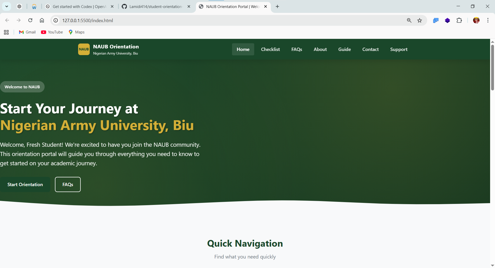

**Homepage** - Main landing page with university branding and navigation

---

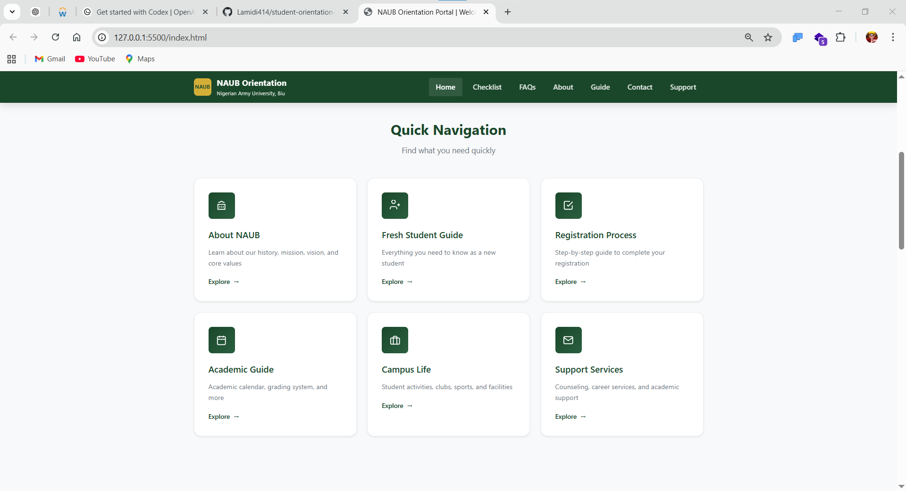

**About Page** - Information about NAUB

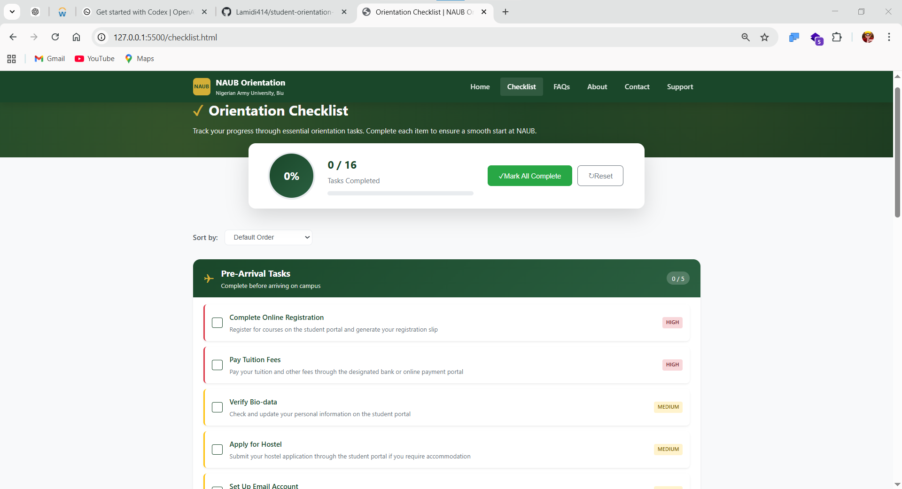

**Academic Guide** - Academic resources and guidelines

---

---

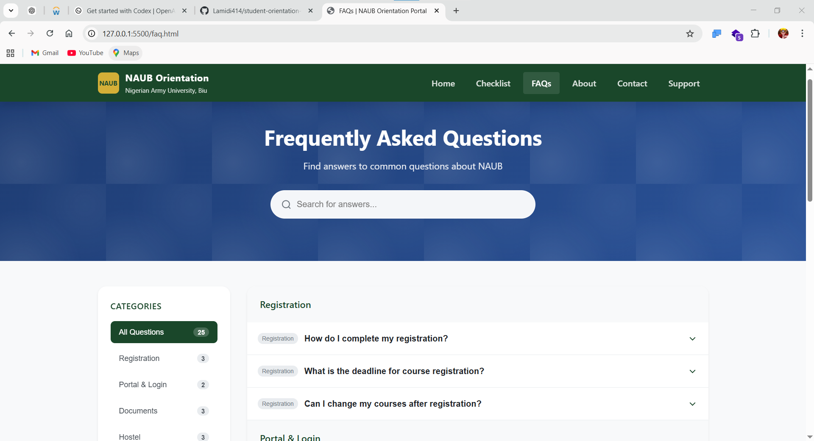

**Campus Life** - Student activities and campus facilities

---

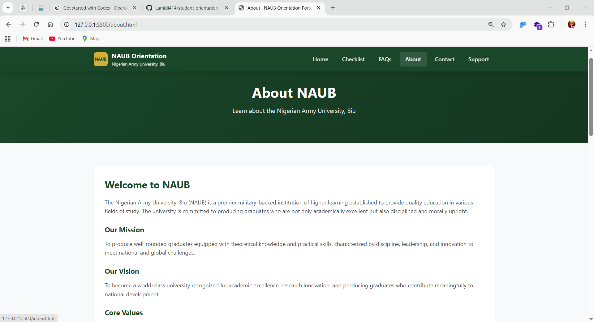

**Student Checklist** - Pre-arrival tasks for new students

---

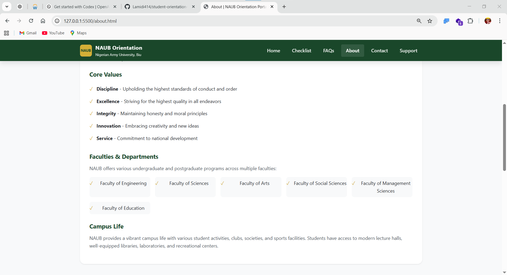

**FAQ Page** - Frequently asked questions

---

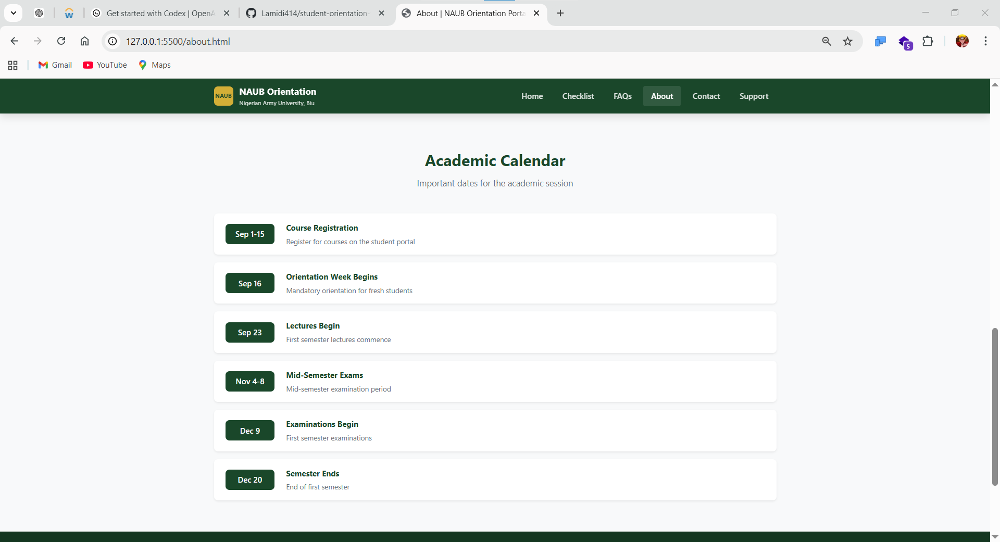

**Fresh Student Guide** - Orientation guide for newcomers

---

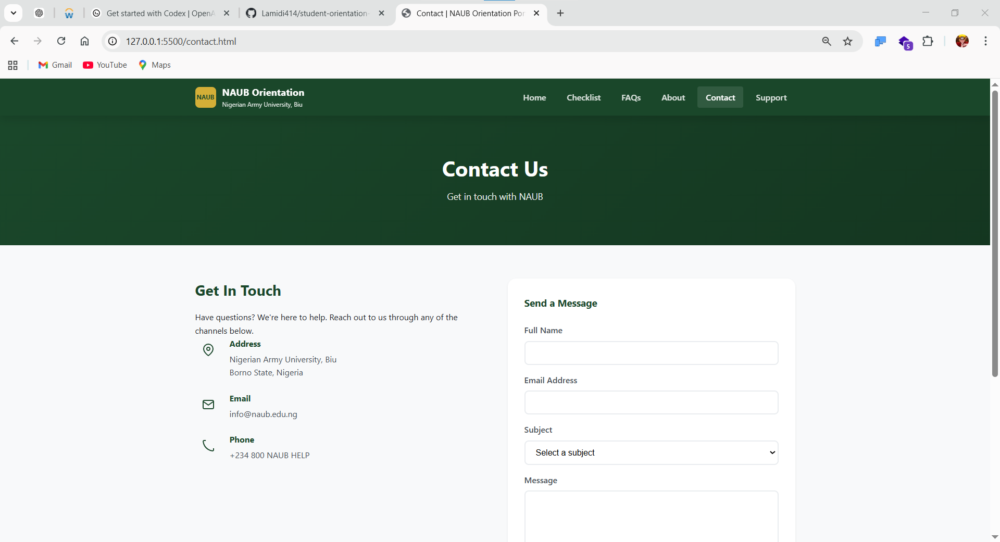

**Registration Guide** - Step-by-step registration process

---

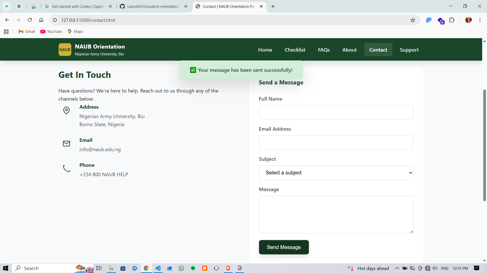

**Rules & Regulations** - University policies

---

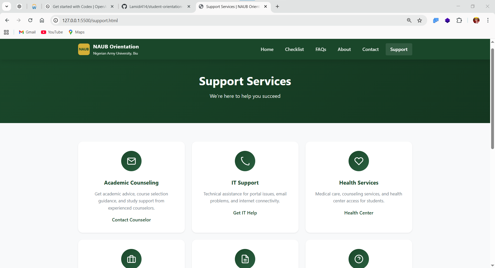

**Support Services** - Available student support

---

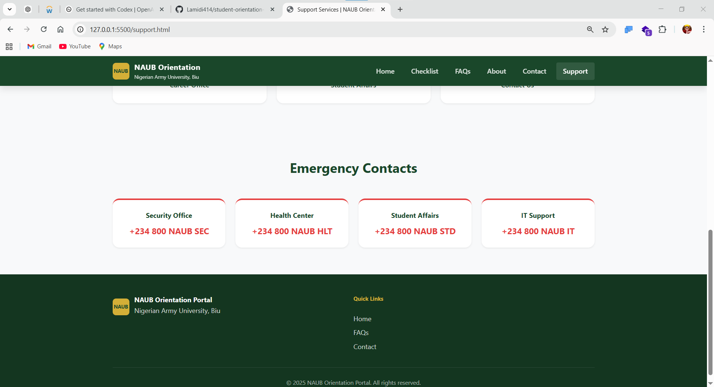

**Contact Page** - Get in touch with the university

---

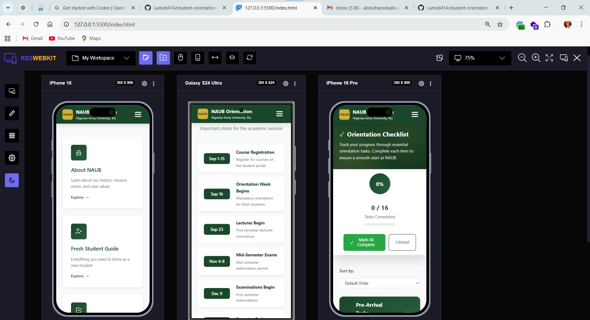

**Admin Dashboard** - Mobile Responsiveness

---


## Project Structure Overview

```
naub-orientation/
├── admin/                    # Admin panel files
│   ├── index.php            # Admin dashboard
│   ├── login.php            # Admin login page
│   ├── logout.php           # Logout handler
│   ├── announcements.php    # Manage announcements
│   ├── checklist.php        # Manage checklist items
│   ├── contacts.php         # Manage contacts
│   ├── faqs.php             # Manage FAQs
│   ├── pages.php            # Manage pages
│   ├── header.php           # Admin header
│   └── footer.php           # Admin footer
│
├── config/                   # Configuration files
│   ├── config.php           # Main site configuration
│   └── db.php               # Database configuration
│
├── css/                      # Stylesheets
│   └── style.css            # Main stylesheet
│
├── includes/                 # Shared PHP files
│   ├── functions.php        # Utility functions
│   ├── header.php           # Site header
│   └── footer.php           # Site footer
│
├── js/                       # JavaScript files
│   └── main.js              # Main JavaScript
│
├── view-img/                 # Project preview screenshots
│
├── database.sql             # Database schema and seed data
├── index.php                # Homepage
├── about.php                # About page
├── academic-guide.php       # Academic guide
├── campus-life.php          # Campus life information
├── checklist.php            # Student checklist
├── contact.php              # Contact page
├── faq.php                  # FAQ page
├── fresh-student-guide.php  # Fresh student guide
├── registration.php         # Registration guide
├── rules.php                # University rules
└── support.php              # Support services
```

### Key Files Description

| File/Directory | Description |
|----------------|-------------|
| [`config/db.php`](config/db.php) | Database connection settings |
| [`config/config.php`](config/config.php) | Site-wide configuration |
| [`includes/functions.php`](includes/functions.php) | Helper functions (sanitization, redirects, etc.) |
| [`admin/login.php`](admin/login.php) | Admin authentication |
| [`admin/index.php`](admin/index.php) | Admin dashboard |
| [`database.sql`](database.sql) | Complete database schema with sample data |
| [`view-img/`](view-img/) | Project screenshots and preview images |

---


## Technology Stack

- **Backend**: PHP 7.4+ (PDO)
- **Database**: MySQL 5.7+
- **Frontend**: HTML5, CSS3, JavaScript
- **Framework**: Bootstrap 5.3
- **Icons**: Font Awesome 6.4

---

## License

This project is for educational purposes. All rights reserved by NAUB.

---

## Author

Lamidi414 @NAUB Student